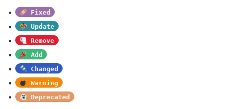

# Hugo tag shortcode
A simple shortcode to add tags for Hugo.

## Install 

- Put the short code in the `/layouts/shortcode/` folder (*If this folder does not exist, create it.*).
- Add the `tag.css` file in the `/static/css` folder (*If this folder does not exist, create it.*).
- Add `<link rel="stylesheet" type="text/css" href="/css/tag.css">` in your `<head> </head>`

## Use

Just add shortcode in your `.md` (*example with emojis*)

```
- 🩹 Fixed 
- 🎊 Update
- 🧻 Remove 
- 🎉 Add
- 🔩 Changed 
- 💣 Warning
- 👻 Deprecated 
```

## Wiki

There are seven basic styles, you can add more simply by adding this line to the `tag.css`.

```
.tag-name {
 background:#your-color;
}
```

## Result


